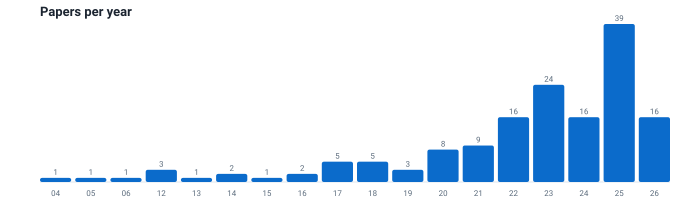
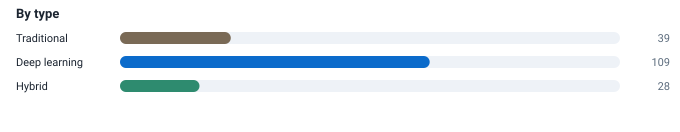

<!-- AUTO-GENERATED FILE - DO NOT EDIT.
     Edit .dev_scripts/config/README.template.md and run from .dev_scripts:
         python -m uie.cli build
-->

# Awesome Underwater Image Enhancement (UIE)

> A curated, **machine-readable** collection of underwater image enhancement papers — 152 entries (2004–2026) with venues, authors, DOIs, code links, controlled tags and one-sentence summaries.

## 🌐 [**Open the interactive site →**](https://fansuregrin1.github.io/Awesome-UIE/)

Search, filter by **year / type / venue / tag**, and browse **live statistics**. Prefer plain files? Use [`PAPERS.md`](PAPERS.md), [`papers.json`](papers.json), [`papers.bib`](papers.bib) or [`collection.csv`](.dev_scripts/collection.csv).

## Contents

- [✨ Highlights](#-highlights)
- [📊 Stats](#-stats)
- [🤖 How it stays up to date](#-how-it-stays-up-to-date)
- [Contributing](#contributing)
- [License](#license)

## ✨ Highlights

- **152 papers** (2004–2026), curated and deduplicated.
- **Rich metadata**: venue, year, authors, DOI, tags, code/project links and an LLM-written **TL;DR**.
- **Coarse `type` + fine-grained `tags`** — `type` stays stable (`Traditional` / `DeepLearning` / `Hybrid`); `tags` capture architecture (`CNN`, `GAN`, `Diffusion`, `Transformer`, `Mamba`, …) and themes (`Color-Correction`, `Physical-Model`, `Dehazing`, `Image-Fusion`, …).
- **Machine-readable**: JSON, BibTeX and CSV exports plus an [`llms.txt`](llms.txt) index.
- **Automated pipeline**: metadata enrichment (arXiv / OpenAlex / Crossref / Semantic Scholar), new-paper discovery, code-link finding, and LLM-assisted TL;DRs and tags.
- **Validated in CI**: schema, duplicates, tag vocabulary and link checks on every change.

## 📊 Stats

| Metric | Value |
| --- | --- |
| Papers | 152 |
| Year range | 2004–2026 |
| With code | 89 |
| With DOI | 145 |
| Traditional | 37 |
| Deep learning | 97 |
| Hybrid | 18 |

## 🤖 How it stays up to date

Everything is generated from `.dev_scripts/papers.yaml` by the tooling in `.dev_scripts/uie/`:

| Command | Purpose |
| --- | --- |
| `python -m uie.cli build` | regenerate README, paper list, charts, exports and site data |
| `python -m uie.cli validate` | schema / duplicate / tag / venue checks |
| `python -m uie.cli enrich` | suggest missing metadata (arXiv / OpenAlex / Crossref) |
| `python -m uie.cli discover` | find new papers |
| `python -m uie.cli code` | find code repositories and project pages |
| `python -m uie.cli llm` | LLM TL;DRs and tag review |
| `python -m uie.cli check-links` | link and repository liveness |

## Contributing

Corrections and additions are welcome. The one rule: **edit `papers.yaml`, not the generated files.**

See [`AGENTS.md`](AGENTS.md) for the schema and workflow.

## License

See [LICENSE](LICENSE).
